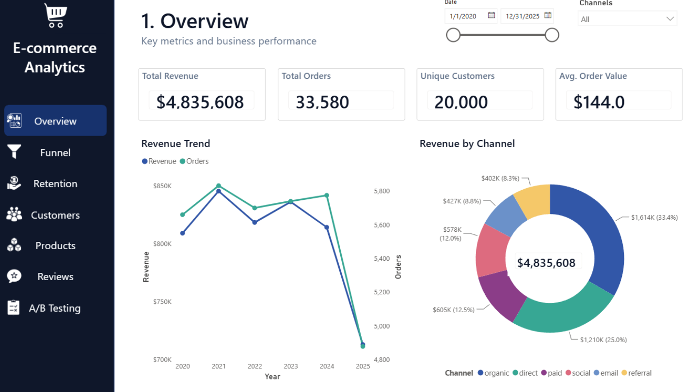
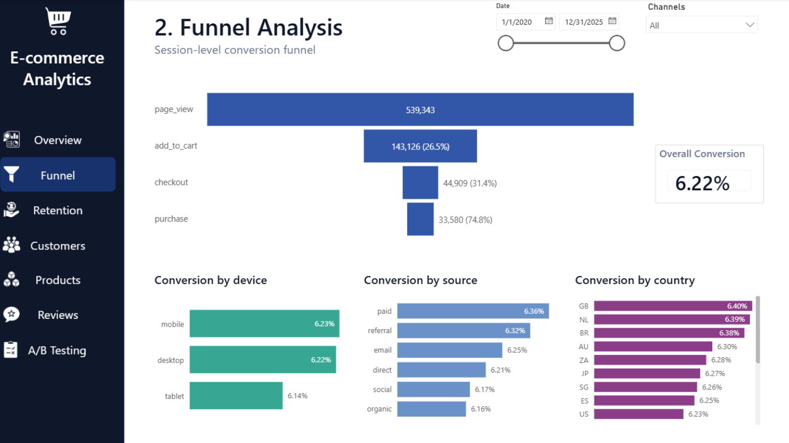
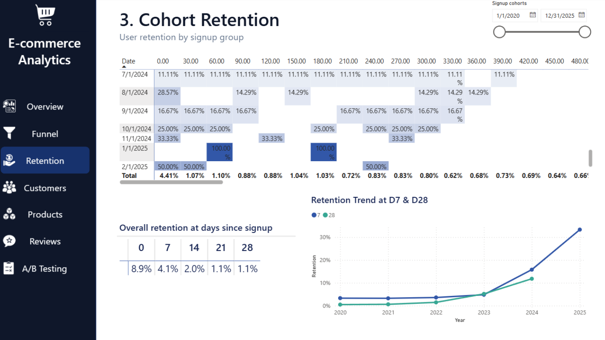
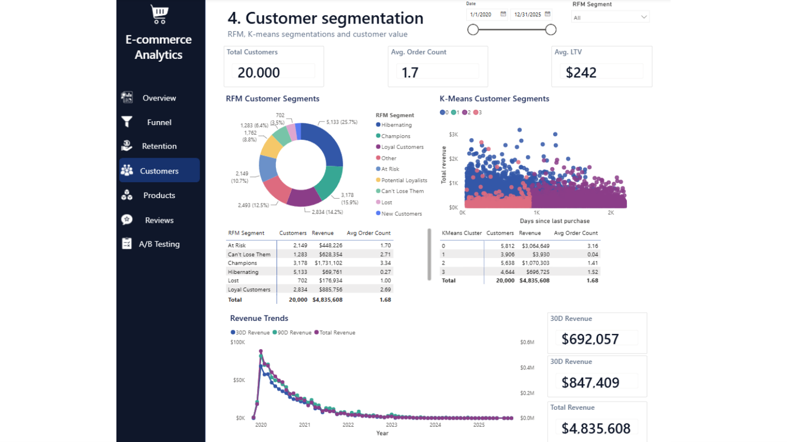
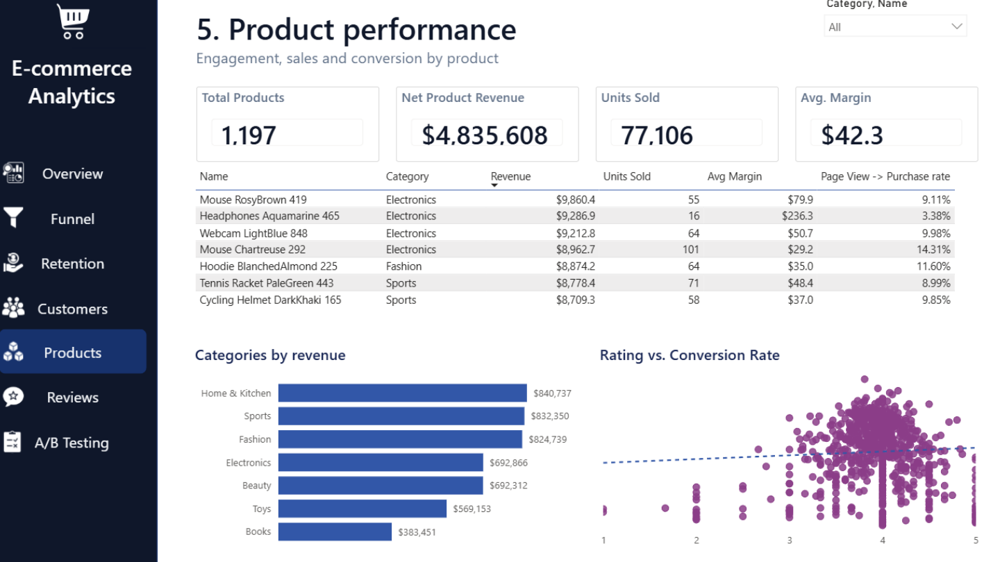
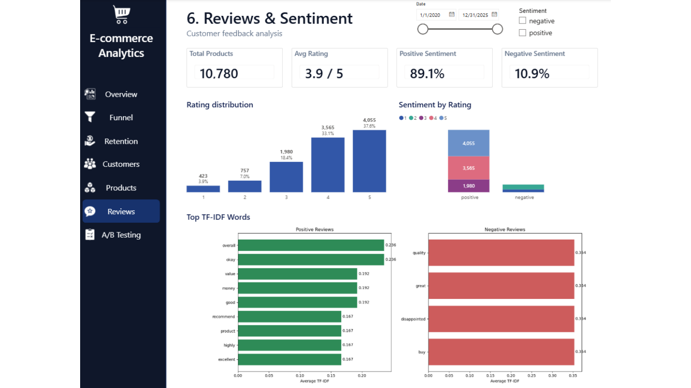
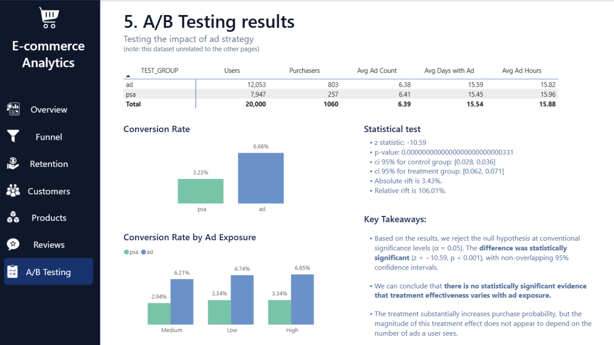

# Ecommerce Product Analytics

An analytics portfolio project that models ecommerce behavioral and transactional data in Snowflake, explores it with Snowpark Python notebooks, and presents the results in a Power BI Project (`.pbip`). The checked-in repository documents the analytical design; raw source data could be found [here on Kaggle](https://www.kaggle.com/datasets/wafaaelhusseini/e-commerce-transactions-clickstream/data).

## What the project covers

| Workstream | Purpose | Main assets |
|---|---|---|
| Data transformation | Builds event, session, user activity, customer value, product performance, and retention datasets. | `snowflake-sql-scripts/` |
| Advanced analysis | Examines funnel progression, cohort retention, customer segmentation, product/review performance, and a separate advertising experiment. | `python-advanced-analysis/` |
| Reporting | Defines an editable Power BI semantic model and seven-page report. | `pbi-dashboards/Dashboards.pbip` |


## Repository layout

```text
ecommerce-product-analytics/
├── snowflake-sql-scripts/          # Snowflake SQL transformation sequence
├── python-advanced-analysis/       # Snowpark Python notebooks
├── pbi-dashboards/                 # Power BI Project, report, and semantic model
├── Power BI Report Screens.pdf     # Exported dashboard screens
└── documentation-deliverables/     # This README, generation script, local venv, Word report
```

## Data model and transformation flow

The SQL scripts refer to the `PRODUCT_ANALYTICS` database and use source objects in `RAW_EVENTS`. They should be executed in numeric order after the source tables are available.

```text
RAW_EVENTS.EVENTS + RAW_EVENTS.SESSIONS ──► FCT_EVENTS / FCT_SESSIONS
RAW_EVENTS.CUSTOMERS_CLEAN + FCT_SESSIONS ─► FCT_USER_ACTIVITY ─► DIM_USER
RAW_EVENTS.ORDERS + ORDER_ITEMS + DIM_USER ─► FCT_CUSTOMER_VALUE
RAW_EVENTS.PRODUCTS + EVENTS + ORDERS + ORDER_ITEMS ─► PRODUCT_PERFORMANCE
DIM_USER + FCT_USER_ACTIVITY ─► USER_RETENTION
```

### SQL assets

1. `01_fct_events.sql` joins events to sessions to add customer and session attributes.
2. `02_fct_sessions.sql` aggregates events to session grain, including funnel counts, flags, duration, and purchase-event revenue.
3. `03_ft_user_activity.sql` aggregates session activity to a customer-day dataset and adds signup/cohort attributes.
4. `04_dim_users.sql` produces one customer record with first activity, first purchase, and activation timing.
5. `05_fct_customer_value.sql` calculates orders, items, revenue, average order value, purchase dates, recency, and 30-/90-day revenue.
6. `06_product_performance.sql` combines product engagement, product-session funnel rates, units, and revenue.
7. `07_user_retention.sql` calculates retained users and retention rate by signup cohort and days since signup.

## Analyses and confirmed findings

The notebooks connect through Snowpark (`get_active_session`) and expect the Snowflake objects named in the SQL layer.

### Funnel

The Power BI event funnel displays 539,343 page views, 143,126 add-to-carts, 44,909 checkouts, and 33,580 purchases: a 6.22% page-view-to-purchase conversion rate. The largest displayed loss is page view to add-to-cart (26.5% progression), while checkout-to-purchase is 74.8%.

The funnel notebook also reports session-level progression: 67.9% from page view to add-to-cart, 55.1% from add-to-cart to checkout, and 74.8% from checkout to purchase. These figures use a different grain and denominator from the event funnel, so they are complementary rather than directly comparable.

### Retention, segmentation, product performance, and reviews

The Power BI report provides the following evidence for 2020–2025:

- $4,835,608 total revenue from 33,580 orders and 20,000 customers; displayed average order value is $144.0.
- Champions represent 3,178 customers (15.9%) and $1,731,102 of revenue (35.8%); Hibernating customers represent 5,133 customers (25.7%) and $69,761 of revenue (1.4%).
- Displayed retention is 8.9% at day 0, 4.1% at day 7, and 1.1% at day 28.
- The product view displays 1,197 products, 77,106 units sold, $42.3 average margin, and $4,835,608 net product revenue. Home & Kitchen, Sports, and Fashion are the three highest-revenue categories.
- The reviews view displays a 3.9/5 average rating, 89.1% positive sentiment, and 10.9% negative sentiment. Per the project owner, local NLTK generated the dashboard sentiment values.

### A/B test: separate demonstration dataset

`05-ab-testing.ipynb` explicitly uses a Kaggle advertising-effectiveness dataset because the ecommerce dataset lacks experiment data. Its notebook reports control conversion of approximately 3.2%, treatment conversion of approximately 6.66%, a 3.43 percentage-point lift, and p < 0.001. It also reports no statistically significant evidence that the treatment effect varies by ad count (p = 0.705) or exposure days (p = 0.387). This result is illustrative and must not be treated as ecommerce-store performance.

## Power BI report

Open `pbi-dashboards/Dashboards.pbip` in Power BI Desktop. The semantic model defines measures for orders, customers, revenue, product revenue, units sold, average session duration, review count/rating/sentiment, retention, and A/B conversion. The report contains seven configured pages.

## Dashboard snapshots

The screenshots below are rendered from the checked-in Power BI report export.

### Overview



### Funnel and retention





### Customer and product performance





### Reviews and A/B testing





## Reporting scope

- Customer recency is reported as of 31 December 2025, matching the dashboard’s stated reporting window. Update or parameterize this as-of date for a future/current refresh.
- `05-ab-testing.ipynb` explicitly uses an external advertising-effectiveness dataset. Its results are a testing-method demonstration, not ecommerce-store performance.

## Running the notebooks

1. Load the raw source tables referenced by the SQL scripts into Snowflake.
2. Run the SQL scripts in sequence, resolving the implementation checks above.
3. Run the notebooks in a Snowflake/Snowpark environment with an active session and the required Python packages (pandas, matplotlib, scikit-learn, and statsmodels). The dashboard sentiment values were generated locally with NLTK, per the project owner.
4. Open the `.pbip` project and refresh only after validating mappings and measures.

## Documentation deliverables

This folder contains an isolated environment, `requirements.txt`, report generator, and screenshot renderer. Regenerate the updated Word report with:

```powershell
.\documentation-deliverables\.venv\Scripts\python.exe .\documentation-deliverables\generate_deliverables.py
```

Render the README screenshots with:

```powershell
.\documentation-deliverables\.venv\Scripts\python.exe .\documentation-deliverables\render_dashboard_screens.py
```

The companion report, `Ecommerce_Product_Analytics_Final_Report_Updated.docx`, gives an executive-ready, evidence-qualified summary, priorities, and recommendations.
